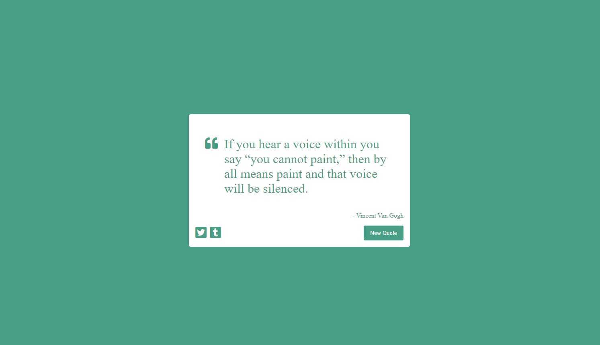

# Random Quote Machine

Random quote machine that fetches quote list from a server and display a random quote at a click of a button (also changing the background).
This is my first project with React JS for freeCodeCamp's Frontend development libraries certification.

## Table of contents

- [Overview](#overview)
  - [Screenshot](#screenshot)
  - [Links](#links)
- [My process](#my-process)
  - [Built with](#built-with)
- [Author](#author)

## Overview

### Screenshot

### Links

- Solution URL: [Random Quote Machine](https://vilmis04.github.io/random-quote-machine)

## My process

### Built with

- React JS

## Author

- Github - [vilmis04](https://github.com/vilmis04)
- LinkedIn - [Vilmantas Sudaris](https://www.linkedin.com/in/vilmantas-sudaris-63567586)
